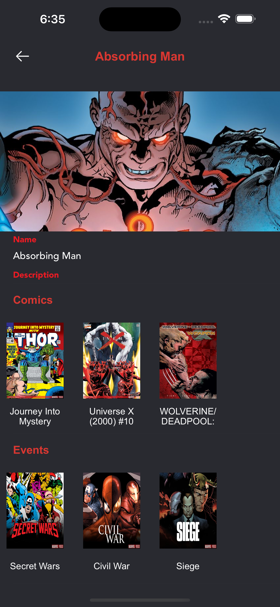

Marvel iOS application written in Swift 5 using MVVM 

## Requirements

- Swift 5.0+
- Xcode 13.0+
- iOS 13.0+ 

## ScreenShots 

| Landing | List  | Details |
| :-: | :-: | :-: |
|  |  | 


## Installation

* Download the project.
* Open the terminal and navigate to the directory of project ```cd Marvel```.
* Install Dependencies with Cocoapods ```pod install```.
* Open the workspace ```open Marvel.xcworkspace```.
  
